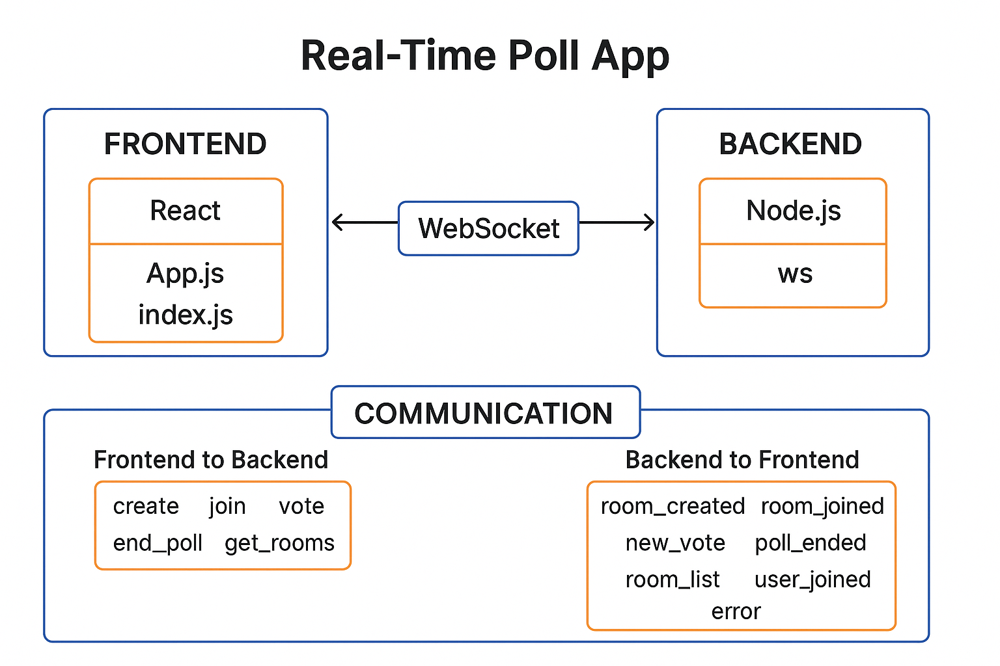

# Real-Time Poll App

A real-time polling application where users can create custom polls, join rooms, vote, and view results instantly. Built with React and WebSocket for seamless live interaction.

---

## 🚀 Features

- ✅ **Create Polls**: Set custom questions and options.
- 🔗 **Join Rooms**: Join existing polls using a room code.
- ⚡ **Real-Time Voting**: See votes update live across all participants.
- 🎛️ **Master Controls**: End the poll early as the poll creator.
- 🕒 **Room Expiry**: Inactive rooms auto-delete after 15 minutes.
- ✍️ **Custom Questions**: Full flexibility to define your poll content.

---

## 🧱 Tech Stack

### Frontend
- **React** – For building dynamic UIs
- **WebSocket** – Real-time updates via WS connections

### Backend
- **Node.js** – Lightweight server runtime
- **ws** – WebSocket library for the backend

### Deployment
- **Docker** – Containerized deployment
- **Nginx** – Serves the frontend

---

## 🔧 Installation

### Prerequisites

- Node.js (v16 or higher)
- Docker (optional, for containerized setup)

### Local Setup

1. **Clone the repository**
   ```bash
   git clone https://github.com/your-username/real-time-poll-app.git
   cd real-time-poll-app
   ````

2. **Install dependencies**

   ```bash
   # Backend
   cd backend
   npm install

   # Frontend
   cd ../frontend
   npm install
   ```

3. **Start the servers**

   ```bash
   # Backend
   cd ../backend
   npm start

   # Frontend
   cd ../frontend
   npm start
   ```

4. **Access the app**
   Open your browser at: [http://localhost:3000](http://localhost:3000)

5. **DEPLOYED LINK**
     Live Demo Check out the deployed version: real-time-polling-app-deployed.netlify.app

---

## 🧪 Usage

### ➕ Create a Poll

* Enter your name
* Add a custom question and options
* Click **Create Poll** to get a room code

### 🔑 Join a Room

* Enter your name
* Enter the room code shared by the creator

### 🗳️ Vote

* Choose an option
* Watch votes update in real-time

### 🔐 End Poll (Creator Only)

* The poll creator can end the session at any time

---

## 🐳 Docker Deployment

Build and run everything using Docker Compose:

```bash
docker-compose up --build
```

App will be live at: [http://localhost:3000](http://localhost:3000)

---

## 📁 Project Structure

```
real-time-poll-app/
├── backend/
│   ├── index.js           # WebSocket server logic
│   ├── package.json       # Backend dependencies
│   └── Dockerfile         # Backend container config
├── frontend/
│   ├── src/
│   │   ├── App.js         # Main React component
│   │   ├── App.css        # Styling
│   │   └── index.js       # React entry point
│   ├── public/
│   │   └── index.html     # Base HTML template
│   ├── package.json       # Frontend dependencies
│   └── Dockerfile         # Frontend container config
├── docker-compose.yml     # Orchestration config
└── README.md              # Project docs
```

---

## 🌐 Environment Variables

### Frontend

* No additional configuration required

### Backend

* WebSocket server runs on port **8080** by default

---


>>>>>>> 08399ea6deaf37b934305020b8ac4c3559057d60
